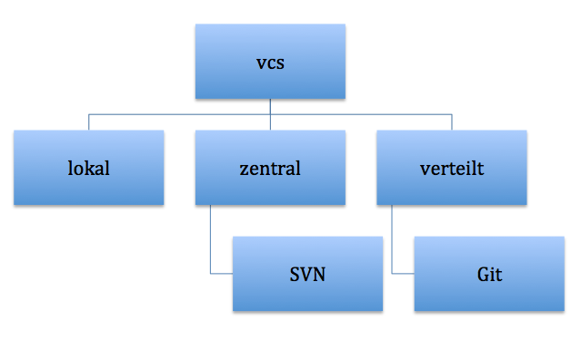
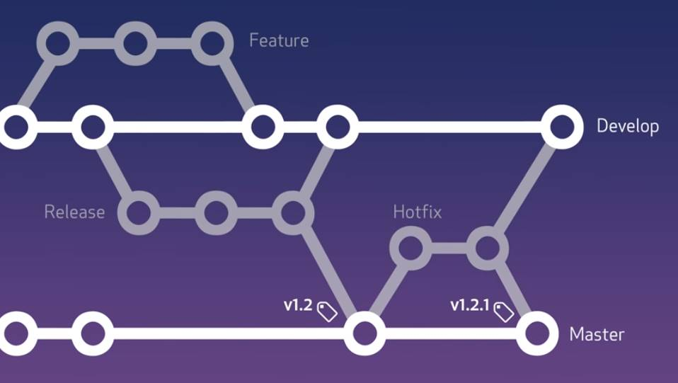
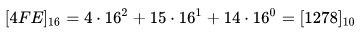
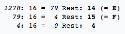

# Zusammenfassung
## 1. VCS

VCS = version control system

Mit dieser Software kann man alle Änderungen von Inhalten nachvollziehen, welche bei Dateien oder Verzeichnissen gemacht worden sind.

## 1.1 Lokales VCS

Die Versionisierung erfolgt lokal auf dem Rechner.

## 1.2 Zentrales VCS

Die Versionisierung erfolgt in einem zentralen Repositorium (Remote Repository oder auch verwalteter Aufbewahrungsort).

Grösster Nachteil: Es wird nicht alles ausgecheckt und somit kann es sein, dass der ganze Code nicht hergestellt werden kann.

Bekanntestes VCS: Suversion SVN

## 1.3 Verteiltes VCS

Die Versionisierung erfolgt zuerst im lokalen Repository beim Benutzer und wird anschliessend mit dem Remote Repository abgeglichen.

Grosser Vorteil: Es wird immer eine vollständige Kopie des Remote Repository erstellt. Dadurch kann bei Ausfall des Remote Repository jedes beliebige lokale Repository als Ersatz eingesetzt werden.

Bekanntestes VCS: Git

## 1.3.1 Git-Befehle

- Clone: bestehendes Repo klonen
- Staus: Zustand überprüfen / Auflistung der Änderungen
- Add: Änderung im Arbeitsverzeichnis der Staging-Umgebung hinzugefügt
- Commit: Änderungen protokollieren/speichern im lokalen Repository
- Checkout: letzte Version einer Datei wiederherstellen
- Fetch: Änderungen überprüfen durch den Vergleich des lokalen und des Remote Repository
- Pull: Änderungen beziehen/übernehmen/herunterladen vom Remote Repository
- Push: Änderungen hochladen/übertragen ins Remote Repository
- Merge: werden Änderungen aus einem anderen Branch in den aktiven Branch übernommen

Detaillierte Befehle: https://confluence.atlassian.com/bitbucketserver/basic-git-commands-776639767.html

## 1.3.2 Onlinedienste

Ein Onlinedienst wie z.B. Github oder Bitbucket stellt eine Infrastuktur und Benutzeroberfläche für Git im Web zur Verfügung. Dieser hat einen Server, auf welchem Git installiert ist.

 

## 2. Terminalemulation / command line

Kommandos

- ls -l: was dort vorhanden ist
- pwd: aktueller Ort wo ich bin
- mk dir: neuer Ordner erstellen
- cd: change directory (Bsp. "cd S + Tab)
- clear: löscht den Verlauf
- . : aktuelles Verzeichnis
- .. : eine Ebene zurück

"man" vor dem Kommando zeigt eine Anleitung

 

## 3. Branches

Branches werden benutzt, um verschiedene Funktionen isoliert voneinander zu entwickeln. Der master-Branch ist der "Standard"-Branch, wenn du ein neues Repository erstellst. Du solltest aber für die Entwicklung andere Branches verwenden und diese dann in den Master-Branch zusammenführen (mergen).

Verwende für jedes Feature oder Issue, an dem du arbeitest, einen separaten Branch. Nachdem du einen Branch erstellt hast. checkst du ihn lokal aus (auf Basis des Master), damit alle deine Änderungen auf diesem Branch stattfinden. Auf diesem Branch kannst du Änderungen wie gewohnt bearbeiten, stagen und committen und das Feature mit so vielen Commits wie nötig erstellen. Genau wie mit Git kannst du an Features arbeiten und Commits durchführen. Wenn du fertig bist, pushe deine Commits und der Feature Branch in Bitbucket wird aktualisiert. Es ist immer empfehlenswert, deinen Feature Branch in das zentrale Repository zu pushen. So schaffst du dir ein praktisches Backup und gibst auch anderen Entwicklern, mit denen du zusammenarbeitest, die Möglichkeit, Commits zu diesem neuen Branch zu sehen.

Strategien:
- Feature Branching
- Release Branching
- Task Branching or Issue Branching

Beispiel einer möglichen Strategie

 

## 4. Merge Konflikte

???

 

## 5. Binärsystem

<b>von binär nach dezimal</b>

110100 = ?

| 1x25 + | 1x24 + | 0x23 + | 1x22 + | 0x21 + | 0x20 | |
|:-------------:|:-------------:|:-------------:|:-------------:|:-------------:|:-------------:|:-------------:|
| 32 | 16 | - | 4 | - | -| = 52 |

<b>von dezimal nach binär</b>

52 = ?

| 26 | 25 | 24 | 23 | 22 | 21 | 20 |
|:-------------:|:-------------:|:-------------:|:-------------:|:-------------:|:-------------:|:-------------:|
| 64 | 32 | 16 | 8 | 4 | 2 | 1 |
|  | 1 | 1 | 0 | 1 | 0 | 0 |

Eine weitere Möglichkeit, um von der dezimalen Zahl zur binären Zahl zu gelangen, wäre die Modulo (mod) Berechnung. Modulo (mod) ist eine mathematische Funktion, die den Rest aus einer Division zweier ganzer Zahlen benennt. Dabei ist nur der Restwert relevant.

Beispiel: 10 mod 3 = 1 (sprich: „zehn modulo drei ist gleich eins“)

 

## 6. Hexadezimalsystem

Im Hexadezimalsystem werden Zahlen in einem Stellenwertsystem zur Basis 16 dargestellt.

Die Berechnung erfolgt gleich wie beim Binärsystem, nur die Potenz ist 16 statt 2 und die Buchstaben kommen dazu.

<b>von hexadezimal nach dezimal</b>

4.F.E. = ?

<b>von dezimal nach hexadezimal</b>

1278 = ?

Vorteil gegenüber Dezimalsystem: Die Hexadezimaldarstellung der Bitfolgen ist leichter zu lesen und schneller zu schreiben.

Wird verwendet für: Das Hexadezimalsystem eignet sich sehr gut, um Folgen von Bits (verwendet in der Digitaltechnik) darzustellen. Vier Stellen einer Bitfolge werden wie eine Dualzahl interpretiert und entsprechen so einer Ziffer des Hexadezimalsystems, da 16 die vierte Potenz von 2 ist. Beispiel
 1010.1100.1101.1100 = ACDC  = 44.252